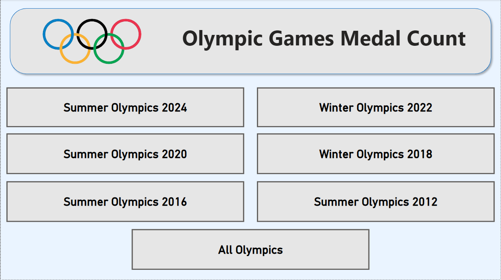
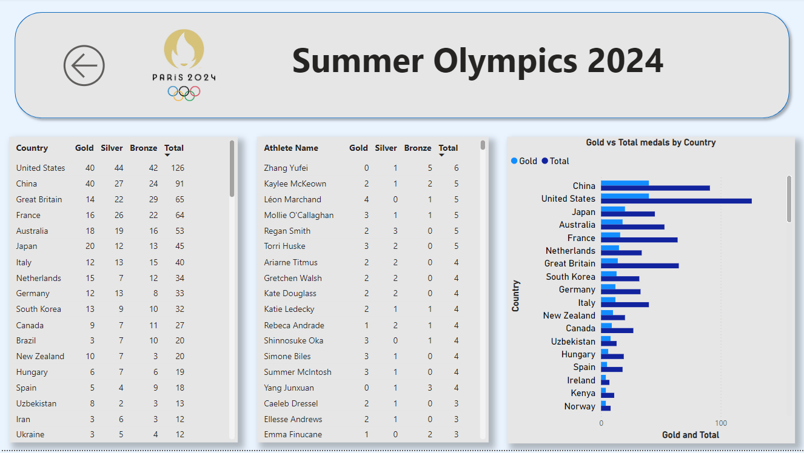

# Olympic_Games_Medal_Count

Download report here: https://github.com/Alexandros-Korolis/Olympic_Games_Medal_Count/blob/main/Olympic_Medals.pbix

## 2024 Week 32 | Power BI: Track the Olympic Medal Count!

### Requirements
1) Get data from a website of choice – I used ESPN.
2) Transform your data
&middot;Do any data cleaning you need in Power Query
&middot;Create measures in Power BI if you need them. I created measures for both metrics and formatting.
3) Add visuals to the canvas. Be sure add at least:
&middot;an informative title
&middot;a table with medal standings
&middot;a visual displaying what team has the highest # of medals overall
&middot;a background image/logo
&middot;buttons to use for custom navigation
4) Add any other design elements that you’d like
5) Ensure that all visuals meet the minimum standards of having alt text, that the tab order in your report makes sense, and that your color choices meet the minimum contrast standards.
6) To keep your tracker up-to-date, be sure to set up a scheduled refresh in the Power BI service.
&middot;If you’re not publishing to the service, you can mimic a scheduled refresh by selecting refresh in the ribbon of Power BI desktop.
7) As always, mix up the design in any way you see fit! This should be fun!

## Files/Steps
1) Medals_by_Country_scrape.ipynb -> Webscrapping using Python, target website ESPN
2) Medals_by_Athletes_scrape.ipynb -> Webscrapping using Python, target website ESPN
3) Export to medals_by_athlete.csv and medals_by_country.csv
4) Olympic_Medals.pbix -> Power BI report
